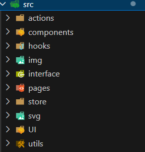
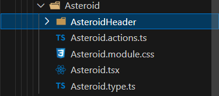
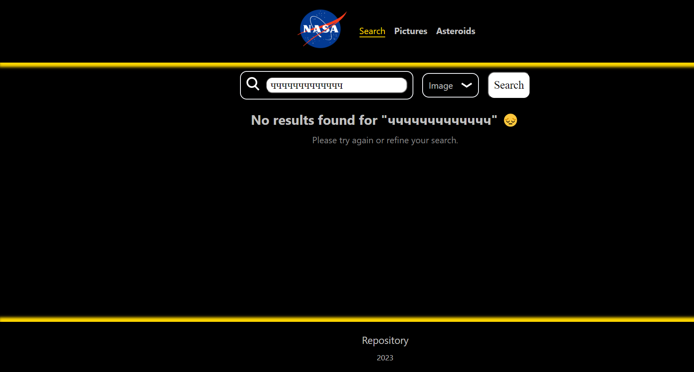
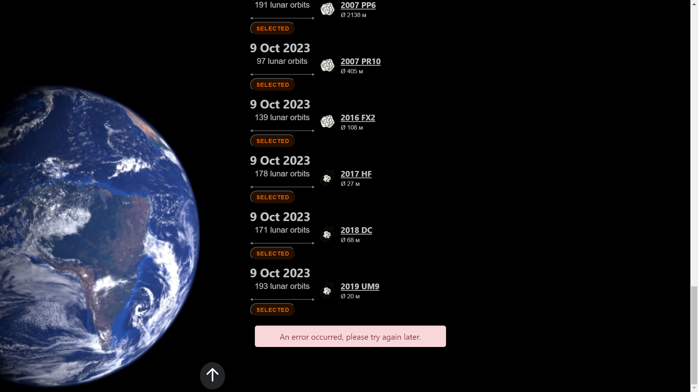
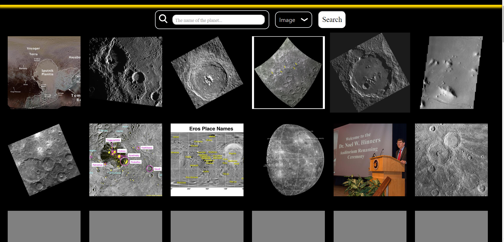

# [Ссылка на проект](https://justdoingl.github.io/nasaApi-reactTS-reduxTK/)

## Руководство по настройке проекта

Приветствую всех!

Для разработки данного приложения были использованы следующие технологии: React, TypeScript, Redux Toolkit, API Nasa, запросы выполнены помощью axios, а также react-router-dom и кастомный хук useInViem

Чтобы начать работу с проектом, выполните следующие шаги:

1. Откройте терминал. 🖥️
2. Перейдите в директорию проекта. 📂
3. Запустите следующую команду для установки необходимых зависимостей:

   ```
   npm i
   ```

   Эта команда установит все необходимые пакеты и зависимости для проекта.
4. После завершения установки выполните следующую команду для запуска сервера разработки:

   ```
   npm start
   ```
## Видео-ролик для знакомства с проектом:


<video width="640" height="320" controls>
  <source src="./helpers/2023-10-08 19-56-01.mp4" type="video/mp4">
  Ваш браузер не поддерживает тег video.
</video>

[Uploading 2023-10-08 19-56-01.mp4…](https://www.youtube.com/watch?v=4Bxm04JZRoM)


## Структура проекта:
1. Краткое описание каждой папки в структуре проекта:

    
   1. actions - папка, содержащая вынесенную логику приложения, которая должна переиспользоваться.
   2. components - папка, содержащая компоненты, которые используются на страницах.
   3. hooks - папка, содержащая кастомные хуки.
   4. img - папка, содержащая картинки или SVG-изображения.
   5. interface - папка, содержащая переиспользуемые интерфейсы для асинхронных запросов или props.
   6. pages - папка, содержащая страницы приложения.
   7. store - папка, содержащая файлы Redux.
   8. svg - папка, содержащая код SVG-файлов.
   9. UI - папка, содержащая компоненты, которые переиспользуются, такие как кнопки и т.д.
   10. utils - папка, содержащая константы.

2. Краткое описание папки в структуре компонент: 
   
    
   1. @.actions - папка, содержащая вынесенную логику приложения из JSX.
   2. @.module - папка, содержащая модульные стили.
   3. @ - папка, содержащая компоненту.
   4. @.type - папка, содержащая вынесенные типы для props.

## В проекте представлены следующие возможности:
- Динамическая подгрузка астероидов на странице Asteroids с помощью инфинити скроллинга;
- Возможность выбора интересующего пользователя астероида на странице Asteroids;
- Обработка загрузки и ошибок на странице Asteroids, обеспечивающая бесперебойную работу приложения;
- Просмотр случайных фотографий или видео на странице Pictures;
- Открытие модального окна при нажатии на фотографию на странице Pictures, где можно более детально рассмотреть выбранное изображение или перейти на страницу с этим фото;
- Реализация поиска по названию медиафайлов на странице Search.

1. На странице Asteroids реализована динамическая подгрузка астероидов, пролетающих рядом с Землей, с помощью инфинити скроллинга. Пользователь может выбрать интересующий его астероид. Страница обрабатывает загрузку и ошибки, что обеспечивает бесперебойную работу приложения.
2. На странице Pictures пользователь может просматривать случайные фотографии или видео. При нажатии на фотографию открывается модальное окно, где можно более детально рассмотреть выбранное изображение или перейти на страницу с этим фото.
3. Наконец, на странице Search реализован поиск по названию медиафайлов. Изначально в задумке была идея реализовать поиск и по видео, но почему-то NASA не предоставляет ссылки на работающий плеер для видео, поэтому эта идея была заморожена.
   
## Демонстрация страниц с обработчкимо ошибок:
1. Если поиск на странице Search не дал результатов, мы можем показать красивое сообщение, которое скажет пользователю, что ничего не найдено, но при этом не снизит его настроения и не вызовет разочарование.
   
      

2. Если возникла ошибка соединения с интернетом или сервером, мы можем показать пользователю соответствующее сообщение, которое поможет ему понять, что произошла ошибка, и что нужно сделать, чтобы ее исправить.
   
      

3. На странице Pictures мы можем реализовать скелетон, который будет показываться во время загрузки контента. Это поможет сделать страницу более интерактивной и улучшить пользовательский опыт, пока контент не будет полностью загружен.
   
      
   


